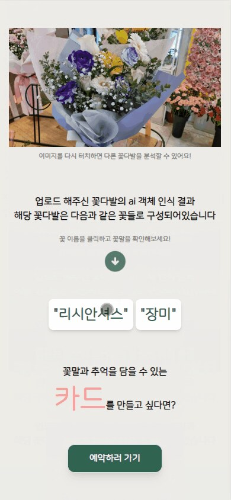
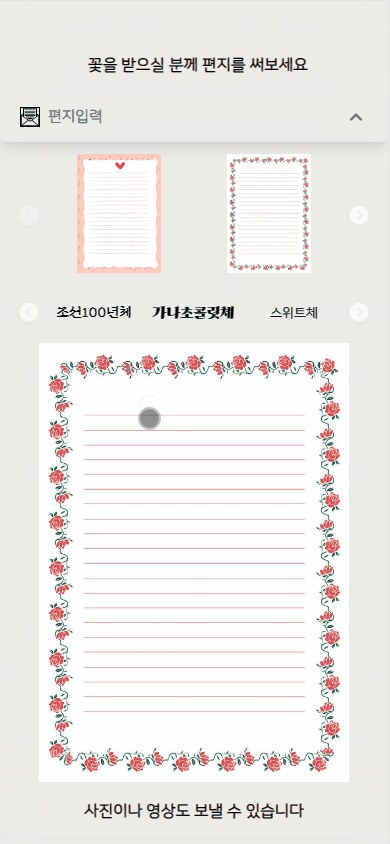
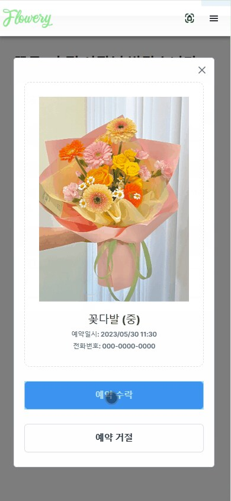
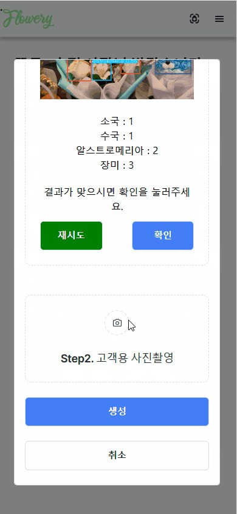

# Flowery

꽃집의 예약·상품·판매 관리를 지원하고 구매자에게 메시지 포토카드 경험을 제공하는 **모바일 웹 플랫폼**입니다.

> 6인 팀으로 진행한 SSAFY 자율 프로젝트입니다.  
> SSAFY 자율 프로젝트 우수팀 3등으로 선정되었습니다.

## 1. 프로젝트 개요

| 구분      | 내용                                                         |
| --------- | ------------------------------------------------------------ |
| 개발 기간 | 2023.04.10 - 2023.05.19 (6주)                                |
| 개발 인원 | 6명 (Frontend 3명, Backend 3명)                              |
| 대상      | 꽃집 운영자와 꽃을 예약·구매하는 고객                        |
| 목표      | 예약부터 판매관리와 메시지 카드까지 연결되는 모바일 서비스 구축 |

꽃집은 예약, 현장 판매와 상품 구성이 일정하지 않아 일반적인 판매관리 시스템을 그대로 적용하기 어렵습니다. 기획 단계부터 꽃집 사장님과 직원의 요구사항을 조사하고, 예약·판매 기록과 꽃에 담긴 메시지 경험을 하나의 서비스로 연결했습니다.

실제 꽃집 두 곳에서 서비스를 제공했으며 총 116명의 이용자 중 105명에게 만족과 재사용 의사를 확인했습니다.

## 2. 주요 기능

### 구매자

- 꽃집과 판매 상품 탐색
- 꽃 상품 예약 및 요청사항 작성
- 꽃 이미지 객체 인식 체험
- 사진·영상과 메시지 작성
- QR카드를 통한 메시지 확인

### 판매자

- 예약 승인·거절과 전체 예약 관리
- 판매 내역 및 분석 정보 확인
- 꽃다발 이미지 인식과 판매 기록 저장
- Canvas 기반 메시지 포토카드 생성
- 판매 상품과 매장 정보 관리

## 3. 기술 스택

### Frontend

- React, TypeScript
- Recoil
- SCSS
- Canvas API

### Backend·AI·Infrastructure

- Spring Boot, Spring Security, JWT
- Flask, Object Detection
- MariaDB, Redis
- AWS EC2·S3, Nginx, Jenkins

## 4. 서비스 화면

<table>
  <tr>
    <td width="25%"></td>
    <td width="25%"></td>
    <td width="25%"></td>
    <td width="25%"></td>
  </tr>
  <tr>
    <td align="center">이미지 객체 인식</td>
    <td align="center">메시지 작성</td>
    <td align="center">예약 관리</td>
    <td align="center">포토카드 제작</td>
  </tr>
</table>

## 5. 서비스 흐름

1. 구매자가 꽃집과 상품을 선택하고 예약합니다.
2. 사진·영상과 함께 꽃에 담을 메시지를 작성합니다.
3. 판매자가 예약을 확인한 뒤 꽃다발을 제작합니다.
4. 꽃다발 이미지를 인식해 꽃의 종류와 수량을 판매 기록으로 저장합니다.
5. 이미지·QR코드·사용자 문구를 합성한 포토카드를 꽃과 함께 전달합니다.

## 6. 담당 역할

- Frontend Lead
- FE·BE 기능 요구사항과 데이터 형식 조율
- 판매자 예약 승인·거절 및 예약 관리 기능 구현
- 상품 관리, 판매 분석과 영업시간 관리 기능 구현
- 로그인 상태와 매장 정보를 Recoil로 관리
- 이미지·QR코드·사용자 문구를 합성하는 Canvas 카드 생성 기능 구현
- 모바일 환경을 고려한 반응형 페이지 설계

## 7. Troubleshooting

### Canvas 기반 카드 생성

**문제**  
파일 업로드, 이미지 인식과 서버 요청이 연속해서 실행되면서 처리 순서에 따라 카드 생성이 지연되거나 이미지·폰트가 정상적으로 합성되지 않는 문제가 발생했습니다.

**해결**  
파일 업로드 → 이미지 인식 → 서버 저장 → QR·사용자 문구 조회 → Canvas 합성 → 이미지 저장 순서로 비동기 흐름을 구성했습니다. 폰트가 완전히 로딩된 이후 Canvas를 그리도록 수정하고, 이미지 처리 단계별 상태를 확인해 오류 발생 지점을 분리했습니다.

### 모바일 화면 검증

실제 꽃집 테스트에서 일부 스마트폰의 화면 깨짐을 확인했습니다. 화면 크기별 스타일과 이미지 영역을 점검해 반응형 UI를 수정하고 현장 피드백을 반영했습니다.

## 8. 결과

- 실제 꽃집 두 곳에서 서비스 제공
- 이용자 116명 중 105명의 만족과 재사용 의사 확인
- SSAFY 자율 프로젝트 우수팀 3등

팀 전체 시스템 구성은 [원본 팀 저장소](https://github.com/Jaetty/Flowery)에서 확인할 수 있습니다.

